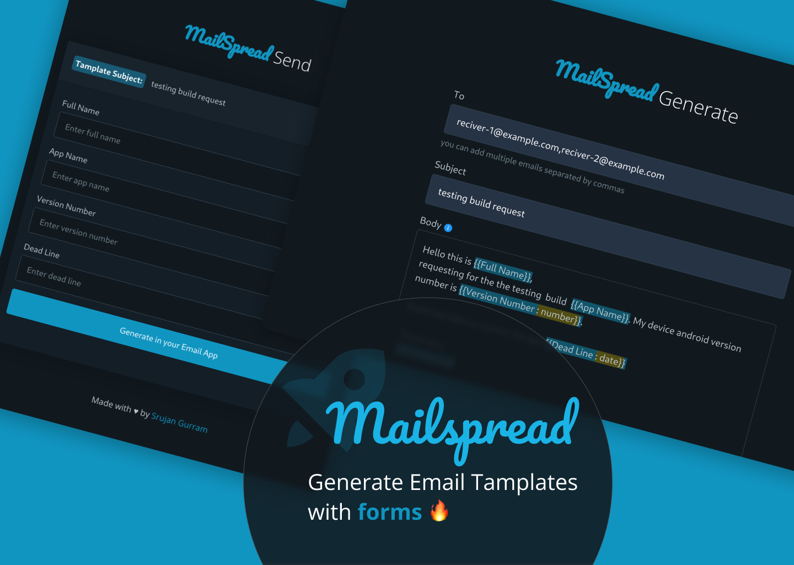

# MailSpread

Generate Email Templates with forms 🔥 

Mailspread lets you to create email template with template tags (left out to fill by your users) and creates a share link. It contains a form and a button to regenerate the template this time with filled in form details in user's email app by mailto link. 

👉 Useful in situations like bunch of people to send a same email template to same set of receivers ⚖️, collecting user information by email which is universal ♾️, creating mini surveys without using other third party apps 📶, etc.

🔗 **Link:** https://mailspread.netlify.app/

[](https://github.com/tterb/atomic-design-ui/blob/master/LICENSEs)
## Screenshots

<center>

</center>
  
## Installation

```bash
git clone https://github.com/Royal-lobster/mailspread

cd mailspread

```
## Running the Application

```bash
./index.html
```
    
## Authors

- [@SrujanGurram](https://www.github.com/royal-lobster)

  
## License

[MIT](https://choosealicense.com/licenses/mit/)

  
